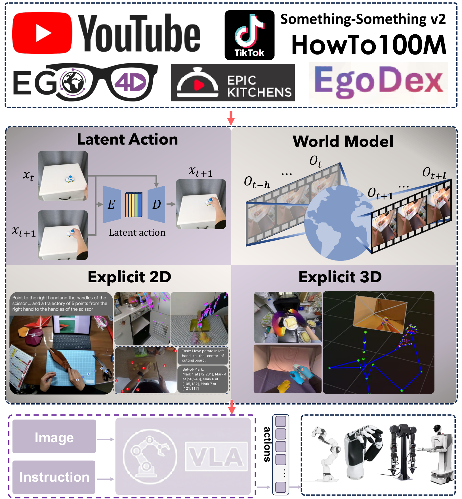

# From Human Videos to Robot Manipulation: A Survey on Action-Relevant Representation Transfer for Scalable Vision-Language-Action Learning

  
  

## 📝 Abstract

<table border="0" cellspacing="0" cellpadding="0" style="border:none !important;border-collapse:collapse !important;">
  <tr>
    <td width="55%" valign="top" style="border:none !important;">
      
Recent progress in generalizable embodied control has been driven by large-scale pretraining of Vision–Language–Action (VLA) models. However, most existing approaches rely on large collections of robot demonstrations, which are costly to obtain and tightly coupled to specific embodiments. Human videos, by contrast, are abundant and capture rich interactions, providing diverse semantic and physical cues for real-world manipulation. Yet, embodiment differences and the frequent absence of task-aligned annotations make their direct use in VLA models challenging.

      
This survey provides a unified view of how human videos are transformed into effective knowledge for VLA models. We categorize existing approaches into four classes based on the action-related information they derive: (i) latent action representations that encode inter-frame changes; (ii) predictive world models that forecast future frames; (iii) explicit 2D supervision that extracts image-plane cues; and (iv) explicit 3D reconstruction that recovers geometry or motion. Beyond this taxonomy, we highlight three key open challenges in this area: structuring unstructured videos into training-ready episodes, grounding video-derived supervision into robot-executable actions under embodiment and viewpoint heterogeneity, and designing evaluation protocols that better predict real-world deployment performance and transfer efficiency, thereby informing future research directions.

    </td>
    <td width="45%" valign="top" style="border:none !important;">
      

        
      

      
<em>Overview of scalable representation bridges for VLA models. To leverage internet-scale human video data (top), existing methods bridge the embodiment gap via four routes: Latent Action Abstraction, Predictive World Modeling, Explicit 2D Cues, and Explicit 3D Structure. These representations transform diverse human videos into action-relevant learning signals, enabling VLA models to generate executable robot actions from image observations and language instructions (bottom).</em>

    </td>
  </tr>
</table>

---

## 🧭 Taxonomy: Action-Relevant Representations

  

  <em>Taxonomy landscape of human-video-to-robot transfer methodologies.</em>

We summarize how human videos are turned into action-relevant signals for VLA models. Existing work mainly follows four routes:

- **Latent Action Abstraction:** learn compact action-like codes from frame changes to replace explicit labels.
- **Predictive World Modeling:** predict future frames/features and reuse the learned dynamics for control.
- **Explicit 2D Cues:** extract image-plane signals (points, masks, flow) as supervision for action learning.
- **Explicit 3D Structure:** recover 3D pose/trajectory to align with robot action spaces.

---

## 🧩 Open challenges highlighted in the paper

We organize open challenges around three interfaces in the human-video-to-robot pipeline:

- **Transforming videos into episodes:** Web-scale videos are rarely trimmed or aligned to manipulation steps. Without reliable episodization, clips mix intents and confuse learning. Future work needs semantic, interaction-driven segmentation and standardized construction protocols.
- **Addressing heterogeneity:** Bridging human videos to robot actions faces embodiment mismatch (hands vs. end-effectors) and viewpoint mismatch (exo/ego vs. robot cameras). More outcome-centric and embodiment-aware grounding is needed to make transfer robust.
- **Benchmarking and evaluation:** Current benchmarks under-represent the diversity and long-horizon structure of internet videos. Evaluation should measure transfer efficiency under fixed robot-data budgets and test generalization across objects, scenes, viewpoints, and embodiments.

See the curated papers in [Paper List by Paradigm](#paper-list-by-paradigm).

## 📚 Human-Centric Data for VLA Learning

We also curate human-video datasets along two axes: whether they provide explicit metric 3D action labels and whether collection is scripted or unscripted. Datasets **without** explicit 3D labels (e.g., SSv2, EPIC-KITCHENS, Ego4D, HowTo100M, Ego-Exo4D, Egocentric-100K) are typically used to infer actions from visual state transitions. Datasets **with** explicit 3D labels (e.g., HOI4D, HOT3D, EgoDex, ARCTIC, TACO, Assembly101, OakInk2, HoloAssist) enable direct grounding but are smaller and often more scripted. See the dataset taxonomy table in the paper for the full list and details.

## 📌 Paper List by Paradigm

### (I) Latent Actions Papers

| Paper                                       | Date    |
| ------------------------------------------- | ------- |
| [LAPA](https://arxiv.org/abs/2410.11758)    | 2024-10 |
| [IGOR](https://arxiv.org/abs/2411.00785)    | 2024-10 |
| [Moto](https://arxiv.org/abs/2412.04445)    | 2024-12 |
| [GO-1](https://arxiv.org/abs/2503.06669)    | 2025-03 |
| [GR00T](https://arxiv.org/abs/2503.14734)   | 2025-03 |
| [UniVLA](https://arxiv.org/abs/2505.06111)  | 2025-05 |
| [Villa-X](https://arxiv.org/abs/2507.23682) | 2025-07 |
| [ViPRA](https://arxiv.org/abs/2511.07732)   | 2025-11 |
| [LAWM](https://arxiv.org/abs/2512.10016)    | 2025-12 |
| [Motus](https://arxiv.org/abs/2512.13030)   | 2025-12 |
| [CLAP](https://arxiv.org/abs/2601.04061)    | 2026-01 |

### (II) World Models

| Paper                                           | Date    |
| ----------------------------------------------- | ------- |
| [GR-1](https://arxiv.org/abs/2312.13139)        | 2023-12 |
| [Gen2Act](https://arxiv.org/abs/2409.16283)     | 2024-09 |
| [GR-2](https://arxiv.org/abs/2410.06158)        | 2024-10 |
| [VPP](https://arxiv.org/abs/2412.14803)         | 2024-12 |
| [FLARE](https://arxiv.org/abs/2505.15659)       | 2025-05 |
| [mimic-video](https://arxiv.org/abs/2512.15692) | 2025-12 |

### (III) Explicit 2D

| Paper                                               | Date    |
| --------------------------------------------------- | ------- |
| [ATM](https://arxiv.org/abs/2401.00025)             | 2023-12 |
| [Magma](https://arxiv.org/abs/2502.13130)           | 2025-02 |
| [Gemini Robotics](https://arxiv.org/abs/2503.20020) | 2025-03 |
| [A0](https://arxiv.org/abs/2504.12636)              | 2025-04 |
| [Masquerade](https://arxiv.org/abs/2508.09976)      | 2025-08 |

### (IV) Explicit 3D Papers

| Paper                                              | Date    |
| -------------------------------------------------- | ------- |
| [VidBot](https://arxiv.org/abs/2503.07135)         | 2025-03 |
| [EgoVLA](https://arxiv.org/abs/2507.12440)         | 2025-07 |
| [Being-H0](https://arxiv.org/abs/2507.15597)       | 2025-07 |
| [H-RDT](https://arxiv.org/abs/2507.23523)          | 2025-07 |
| [MotionTrans](https://arxiv.org/abs/2509.17759)    | 2025-09 |
| [Yoshida et al.](https://arxiv.org/abs/2509.21986) | 2025-09 |
| [VITRA](https://arxiv.org/abs/2510.21571)          | 2025-10 |
| [In-N-On](https://arxiv.org/abs/2511.15704)        | 2025-11 |
| [Simar et al.](https://arxiv.org/abs/2512.22414)   | 2025-12 |