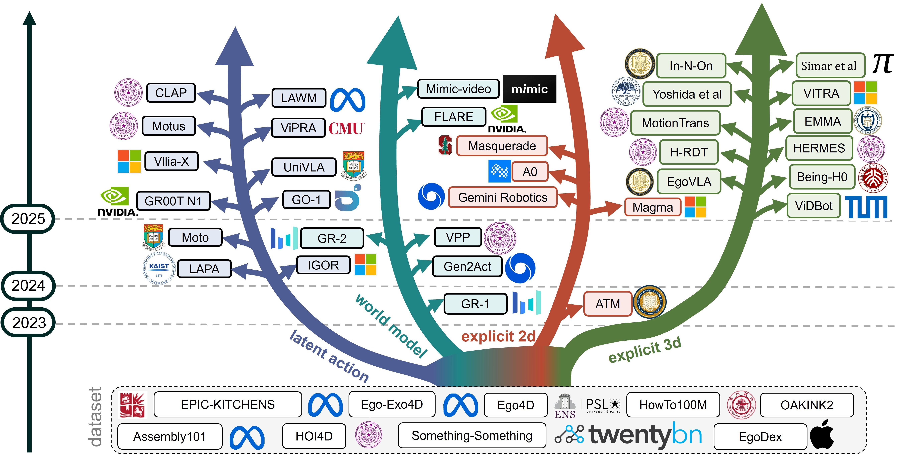

# From Human Videos to Robot Manipulation: A Survey on Action-Relevant Representation Transfer for Scalable Vision-Language-Action Learning

This repository hosts the paper, figures, and (optional) companion materials for our survey on **using human videos as scalable supervision for Vision–Language–Action (VLA) learning**, focusing on how video signals are transformed into **action-relevant representations** that can bridge the embodiment gap to robot control.

> **Key idea:** human videos are abundant but not directly “action data” for robots. We organize methods by the *representation bridge* they construct between passive video observation and robot-executable actions.

---

## 📄 Paper

- **Title:** *From Human Videos to Robot Manipulation: A Survey on Action-Relevant Representation Transfer for Scalable Vision-Language-Action Learning*
- **Venue:** IJCAI–ECAI 2026 (Survey Track) submission
- **PDF:** `paper/ijcai_ecai_2026_survey.pdf`

### Abstract (high level)
We provide a unified view of how human videos become effective training signals for VLA models, via four major paradigms:
1) **Latent Actions** (encode inter-frame changes into tokens/embeddings)  
2) **World Models** (forecast future frames/features and distill into policies)  
3) **Explicit 2D** cues (tracks/keypoints/masks/boxes as supervision)  
4) **Explicit 3D** structure (hand/object pose, trajectories, MANO/meshes, etc.)

We also discuss open challenges around (i) episodizing unstructured videos, (ii) grounding under embodiment/viewpoint heterogeneity, and (iii) deployment-predictive evaluation and transfer efficiency.

---

## 🧭 Taxonomy at a glance

Our survey categorizes human-video-to-robot transfer methods by **intermediate representation** (see Fig. 1 & Fig. 2 in the paper):
- **Latent Action Abstraction**: compact discrete/continuous proxies for actions  
- **Predictive World Modeling**: future prediction as action-relevant learning signal  
- **Explicit 2D Representations**: point tracks / keypoints / boxes / contact points  
- **Explicit 3D Representations**: SE(3) trajectories, MANO hand states, object pose changes, 3D affordances  

We also include:
- **Table 1:** method taxonomy + video sources + representation + end-effector  
- **Table 2:** human-video dataset map by (explicit 3D signals) × (scripted vs in-the-wild)

### Taxonomy Figure

  

  <em>Figure: Taxonomy landscape of human-video-to-robot transfer methodologies.</em>

## 📌 Paper List by Paradigm (WIP)

### (I) Latent Actions Papers

| Paper | Year | Link |
| --- | --- | --- |
| **LAPA** | 2024 | [arXiv:2410.11758](https://arxiv.org/abs/2410.11758) |
| **IGOR** | 2024 | [arXiv:2411.00785](https://arxiv.org/abs/2411.00785) |
| **Moto** | 2024 | [arXiv:2412.04445](https://arxiv.org/abs/2412.04445) |
| **GO-1** | 2025 | [arXiv:2503.06669](https://arxiv.org/abs/2503.06669) |
| **GR00T** | 2025 | [arXiv:2503.14734](https://arxiv.org/abs/2503.14734) |
| **UniVLA** | 2025 | [arXiv:2505.06111](https://arxiv.org/abs/2505.06111) |
| **Villa-X** | 2025 | [arXiv:2507.23682](https://arxiv.org/abs/2507.23682) |
| **ViPRA** | 2025 | [arXiv:2511.07732](https://arxiv.org/abs/2511.07732) |
| **LAWM** | 2025 | [arXiv:2512.10016](https://arxiv.org/abs/2512.10016) |
| **Motus** | 2025 | [arXiv:2512.13030](https://arxiv.org/abs/2512.13030) |
| **CLAP** | 2026 | [arXiv:2601.04061](https://arxiv.org/abs/2601.04061) |

### (II) World Models

| Paper | Year | Link |
| --- | --- | --- |
| **GR-1** | 2023 | [arXiv:2312.13139](https://arxiv.org/abs/2312.13139) |
| **GR-2** | 2024 | [arXiv:2410.06158](https://arxiv.org/abs/2410.06158) |
| **VPP** | 2024 | [arXiv:2412.14803](https://arxiv.org/abs/2412.14803) |
| **FLARE** | 2025 | [arXiv:2505.15659](https://arxiv.org/abs/2505.15659) |
| **mimic-video** | 2025 | [arXiv:2512.15692](https://arxiv.org/abs/2512.15692) |
| **Gen2Act** | 2024 | [arXiv:2409.16283](https://arxiv.org/abs/2409.16283) |

### (III) Explicit 2D Papers

| Paper | Year | Link |
| --- | --- | --- |
| **ATM** | 2024 | [arXiv:2401.00025](https://arxiv.org/abs/2401.00025) |
| **Magma** | 2025 | [arXiv:2502.13130](https://arxiv.org/abs/2502.13130) |
| **Gemini Robotics** | 2025 | [arXiv:2503.20020](https://arxiv.org/abs/2503.20020) |
| **A0** | 2025 | [arXiv:2504.12636](https://arxiv.org/abs/2504.12636) |
| **Masquerade** | 2025 | [arXiv:2508.09976](https://arxiv.org/abs/2508.09976) |

### (IV) Explicit 3D Papers

| Paper | Year | Link |
| --- | --- | --- |
| **VidBot** | 2025 | [arXiv:2503.07135](https://arxiv.org/abs/2503.07135) |
| **EgoVLA** | 2025 | [arXiv:2507.12440](https://arxiv.org/abs/2507.12440) |
| **Being-H0** | 2025 | [arXiv:2507.15597](https://arxiv.org/abs/2507.15597) |
| **H-RDT** | 2025 | [arXiv:2507.23523](https://arxiv.org/abs/2507.23523) |
| **MotionTrans** | 2025 | [arXiv:2509.17759](https://arxiv.org/abs/2509.17759) |
| **Yoshida et al.** | 2025 | [arXiv:2509.21986](https://arxiv.org/abs/2509.21986) |
| **VITRA** | 2025 | [arXiv:2510.21571](https://arxiv.org/abs/2510.21571) |
| **In-N-On** | 2025 | [arXiv:2511.15704](https://arxiv.org/abs/2511.15704) |
| **Simar et al.** | 2025 | [arXiv:2512.22414](https://www.google.com/search?q=https://arxiv.org/abs/2512.22414) |

---

## 🧩 Open challenges highlighted in the paper

We organize future directions around three interfaces:
1. **Episodization:** turning web-scale, untrimmed videos into training-ready episodes  
2. **Heterogeneity-aware grounding:** embodiment mismatch (human hand vs robot EE) + viewpoint mismatch (exo/ego vs robot cameras)  
3. **Benchmarking:** evaluation protocols that predict **real deployment performance** and **transfer efficiency under a robot-data budget**
